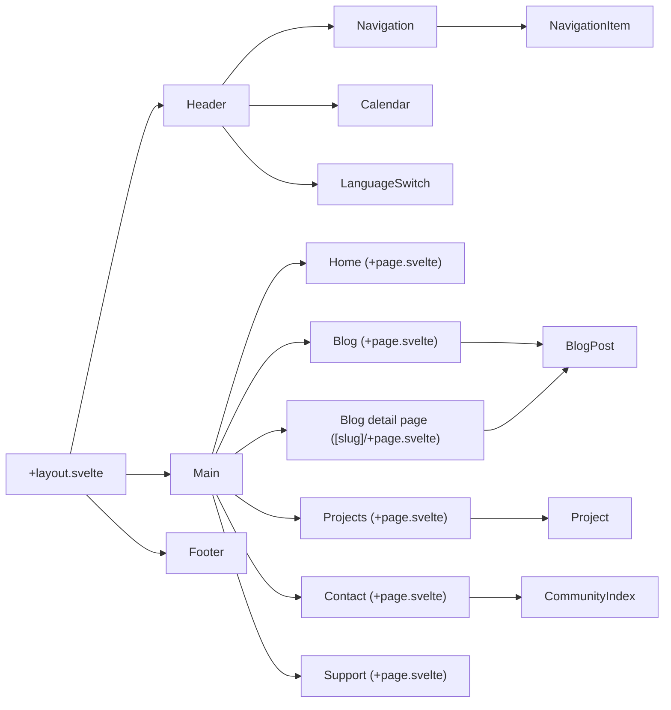

# osmnl-website

This repository contains the source code for the for a new concept for the [OpenStreetMap Netherlands](https://www.openstreetmap.nl/) website. This is built using [SvelteKit](https://kit.svelte.dev/), and is currently still a work in progress.

## Running the project

To run the project, you need to have [Node.js](https://nodejs.org/en/) installed. Once you have that, you can run the following commands:

```bash
# Install dependencies
npm install

# Run the project in development mode
npm run dev
```

## Building the project

To build the project, you can run the following command:

```bash
npm run build
```

## Components


